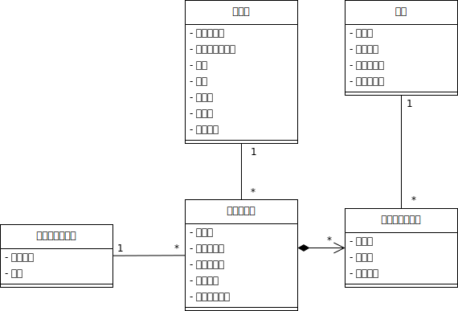
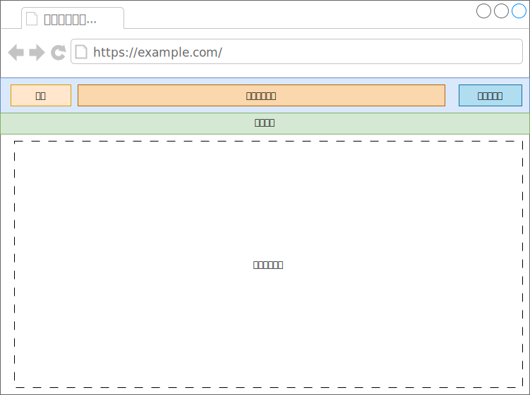
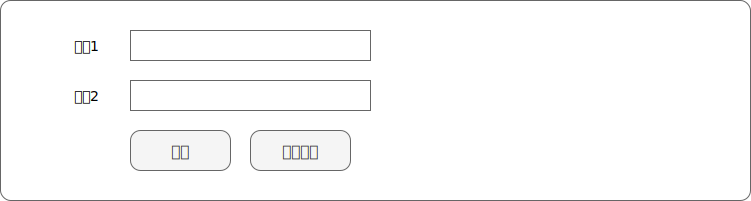
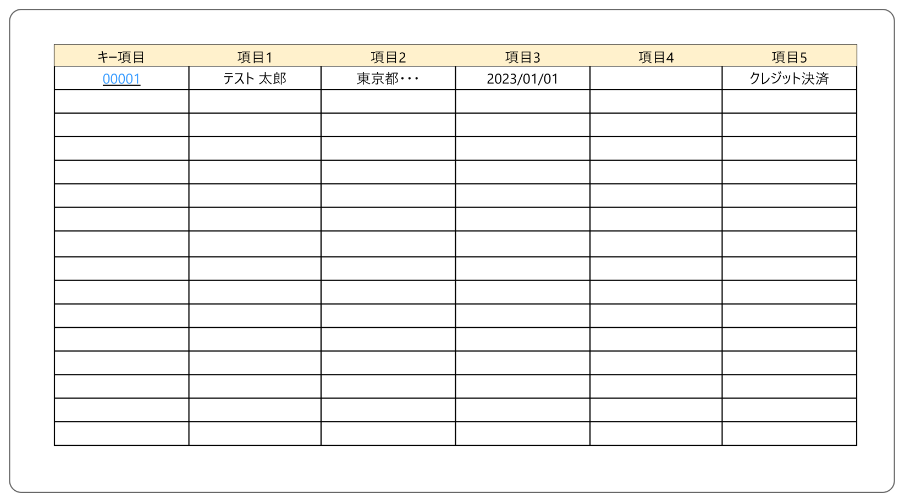

2025年8月18日更新

目次

[1 基本設計 [2]][2]

[1.1 ユースケース [2][1]][1]

[1.1.1 加入者情報管理機能 [3]][3]

[1.1.2 料金管理機能 [4]][4]

[1.1.3 請求データ作成機能 [5]][5]

[1.2 概念モデル [6]][6]

[2 外部設計 [7]][7]

[2.1 サービス管理システムの関係性 [7][8]][8]

[2.2 サービス管理アプリケーションのフロー [7][9]][9]

[2.3 UI設計ポリシー [8]][8]

[2.3.1 前提条件 [8][10]][10]

[2.3.2 画面レイアウト [8][11]][11]

[2.3.3 画面機能レイアウトパターン [9]][9]

[2.3.4 項目パターン [11]][11]

[2.3.5 入力制限一覧 [12]][12]

[2.4 バッチ設計 [13]][13]

[2.4.1 バッチ概要 [13][14]][14]

[2.4.2 ジョブフロー [13][15]][15]

[2.5 データベース設計 [14]][14]

[2.5.1 ER図 [14][16]][16]

[2.5.2 テーブル定義 [14][17]][17]

# 基本設計

## ユースケース

修正箇所

### 加入者情報管理機能

<table>
<colgroup>
<col style="width: 21%" />
<col style="width: 78%" />
</colgroup>
<thead>
<tr>
<th>ユースケース名</th>
<th>加入者を登録する</th>
</tr>
</thead>
<tbody>
<tr>
<td>主アクター</td>
<td>管理者</td>
</tr>
<tr>
<td>事前条件</td>
<td>なし</td>
</tr>
<tr>
<td>主シナリオ</td>
<td><ol type="1">
<li>
管理者は、加入者登録画面を表示する
</li>
<li>
サービス管理システムは、加入者登録画面を表示する
</li>
<li>
管理者は加入者情報を登録する。
</li>
<li>
サービス管理システムは、加入者情報を保存する
</li>
<li>
管理者は、加入者情報を確認する
</li>
</ol></td>
</tr>
<tr>
<td>拡張シナリオ</td>
<td>4a. サービス管理システムは入力エラーを表示する</td>
</tr>
<tr>
<td>成功時保証</td>
<td>加入者情報がデータベースに登録される</td>
</tr>
</tbody>
</table>

<table>
<colgroup>
<col style="width: 21%" />
<col style="width: 78%" />
</colgroup>
<thead>
<tr>
<th>ユースケース名</th>
<th>加入者を編集する</th>
</tr>
</thead>
<tbody>
<tr>
<td>主アクター</td>
<td>管理者</td>
</tr>
<tr>
<td>事前条件</td>
<td>加入者情報が登録済みであること</td>
</tr>
<tr>
<td>主シナリオ</td>
<td><ol type="1">
<li>
管理者は、加入者情報を検索する
</li>
<li>
サービス管理システムは、加入者情報の一覧を名前基準に昇順で表示する。
</li>
<li>
管理者は、一覧から対象の加入者を選択する。
</li>
<li>
サービス管理システムは加入者情報を表示する。
</li>
<li>
管理者は、加入者情報を修正する。
</li>
<li>
サービス管理システムは、加入者情報を保存する。
</li>
<li>
管理者は、加入者情報を確認する
</li>
</ol></td>
</tr>
<tr>
<td>拡張シナリオ</td>
<td>6a. サービス管理システムは入力エラーを表示する</td>
</tr>
<tr>
<td>成功時保証</td>
<td>加入者情報が更新される</td>
</tr>
</tbody>
</table>

<table>
<colgroup>
<col style="width: 21%" />
<col style="width: 78%" />
</colgroup>
<thead>
<tr>
<th>ユースケース名</th>
<th>加入者を削除する</th>
</tr>
</thead>
<tbody>
<tr>
<td>主アクター</td>
<td>管理者</td>
</tr>
<tr>
<td>事前条件</td>
<td>加入者情報が登録済みであること</td>
</tr>
<tr>
<td>主シナリオ</td>
<td><ol type="1">
<li>
管理者は、加入者情報を検索する
</li>
<li>
サービス管理システムは、加入者情報の一覧を名前基準に昇順で表示する。
</li>
<li>
管理者は、一覧から対象の加入者を選択する。
</li>
<li>
サービス管理システムは加入者情報を表示する。
</li>
<li>
管理者は、加入者情報を削除する。
</li>
<li>
サービス管理システムは、加入者情報を保存する。
</li>
<li>
管理者は、加入者情報を確認する
</li>
</ol></td>
</tr>
<tr>
<td>拡張シナリオ</td>
<td>6a. サービス管理システムは入力エラーを表示する</td>
</tr>
<tr>
<td>成功時保証</td>
<td>加入者情報が削除される</td>
</tr>
</tbody>
</table>

### 料金管理機能

<table>
<colgroup>
<col style="width: 21%" />
<col style="width: 78%" />
</colgroup>
<thead>
<tr>
<th>ユースケース名</th>
<th>料金情報を登録する</th>
</tr>
</thead>
<tbody>
<tr>
<td>主アクター</td>
<td>管理者</td>
</tr>
<tr>
<td>事前条件</td>
<td>登録対象が登録されていないこと</td>
</tr>
<tr>
<td>主シナリオ</td>
<td><ol type="1">
<li>
管理者は、基本料金登録画面を表示する
</li>
<li>
サービス管理システムは、基本料金登録画面を表示する
</li>
<li>
管理者は料金情報を登録する。
</li>
<li>
サービス管理システムは、料金情報を保存する
</li>
<li>
管理者は、料金情報を確認する
</li>
</ol></td>
</tr>
<tr>
<td>拡張シナリオ</td>
<td>4a. サービス管理システムは入力エラーを表示する</td>
</tr>
<tr>
<td>成功時保証</td>
<td>料金情報がデータベースに登録される</td>
</tr>
</tbody>
</table>

<table>
<colgroup>
<col style="width: 21%" />
<col style="width: 78%" />
</colgroup>
<thead>
<tr>
<th>ユースケース名</th>
<th>加入者情報を編集する</th>
</tr>
</thead>
<tbody>
<tr>
<td>主アクター</td>
<td>管理者</td>
</tr>
<tr>
<td>事前条件</td>
<td>加入者情報が登録済みであること</td>
</tr>
<tr>
<td>主シナリオ</td>
<td><ol type="1">
<li>
管理者は、料金情報を検索する
</li>
<li>
サービス管理システムは、料金情報の一覧を名前基準に昇順で表示する。
</li>
<li>
管理者は、一覧から対象の基本料金を選択する。
</li>
<li>
サービス管理システムは料金情報を表示する。
</li>
<li>
管理者は、料金情報を修正する。
</li>
<li>
サービス管理システムは、料金情報を保存する。
</li>
<li>
管理者は、料金情報を確認する
</li>
</ol></td>
</tr>
<tr>
<td>拡張シナリオ</td>
<td>6a. サービス管理システムは入力エラーを表示する</td>
</tr>
<tr>
<td>成功時保証</td>
<td>料金情報が更新される</td>
</tr>
</tbody>
</table>

<table>
<colgroup>
<col style="width: 21%" />
<col style="width: 78%" />
</colgroup>
<thead>
<tr>
<th>ユースケース名</th>
<th>料金情報を削除する</th>
</tr>
</thead>
<tbody>
<tr>
<td>主アクター</td>
<td>管理者</td>
</tr>
<tr>
<td>事前条件</td>
<td>料金情報が登録済みであること</td>
</tr>
<tr>
<td>主シナリオ</td>
<td><ol type="1">
<li>
管理者は、料金情報を検索する
</li>
<li>
サービス管理システムは、料金情報の一覧を名前基準に昇順で表示する。
</li>
<li>
管理者は、一覧から対象の基本料金を選択する。
</li>
<li>
サービス管理システムは料金情報を表示する。
</li>
<li>
管理者は、料金情報を削除する。
</li>
<li>
サービス管理システムは、料金情報を保存する。
</li>
</ol></td>
</tr>
<tr>
<td>拡張シナリオ</td>
<td>6a. サービス管理システムは入力エラーを表示する</td>
</tr>
<tr>
<td>成功時保証</td>
<td>加入者情報が削除される</td>
</tr>
</tbody>
</table>

### 請求データ作成機能

<table>
<colgroup>
<col style="width: 21%" />
<col style="width: 78%" />
</colgroup>
<thead>
<tr>
<th>ユースケース名</th>
<th>請求データを作成する</th>
</tr>
</thead>
<tbody>
<tr>
<td>主アクター</td>
<td>サービス管理システム</td>
</tr>
<tr>
<td>事前条件</td>
<td>このユースケースは毎月1日に1回実行されること</td>
</tr>
<tr>
<td>主シナリオ</td>
<td><ol type="1">
<li>
サービス管理システムは、加入者ごと基本料金と追加オプション料金を集計し、請求データを作成する。
</li>
<li>
請求データおよび請求明細データテーブルにトランザクションとしてレコード追加する。
</li>
<li>
サービス管理システムはトランザクションを確定する。
</li>
</ol></td>
</tr>
<tr>
<td>拡張シナリオ</td>
<td>2a. 処理中にエラーが発生した場合は中断し、トランザクションを破棄する。</td>
</tr>
<tr>
<td>成功時保証</td>
<td>当月分の請求データおよび請求明細データが作成される</td>
</tr>
</tbody>
</table>

## 概念モデル

ソース：[Java研修.drawio] → 概念モデルシート

# 外部設計

## サービス管理システムの関係性

- 全ての情報は、サービス管理データベース(K_SRVMAN)の各テーブルに格納される。

- データの閲覧、登録、修正は「サービス管理アプリケーション(KAP)」にて行う。

- 月次、日次など定期的に行う一括処理は「サービス管理バッチ処理(KBT)」にて行う。

## サービス管理アプリケーションのフロー

- 未ログインの場合は、各画面を表示する前にログイン画面を表示する。

- 画面上部の機能メニューからトップ画面や各情報の検索画面へ遷移できる。なお、画面に入力したデータは、画面が遷移するとすべて失われる。

## UI設計ポリシー

### 前提条件

本システムのクライアントにはWebブラウザを用いる。

| 対応ブラウザ     | 最新のMicrosoft Edge、Google Chrome、Firefox |
|------------------|----------------------------------------------|
| 画面レイアウト幅 | ブラウザに合わせて可変とする。               |
| 文字コード       | UTF-8                                        |

表 3-1

### 画面レイアウト

本システムの画面レイアウトは、次の通りとする。なお、背景色は領域を表す

| ヘッダー     | システムロゴ、機能メニュー、ログイン名を表示します         |
|--------------|------------------------------------------------------------|
| 機能メニュー | クリックすると各機能へ移動するリンクを列挙して表示します。 |
| ログアウト   | クリックするとログアウトするリンクを表示します。           |
| タイトル     | 機能のタイトルを表示します                                 |
| 機能のボディ | 各機能の内容を表示します                                   |

表 3-2

### 画面機能レイアウトパターン

| 検索条件入力画面 | 情報を検索する際の条件を入力する画面パターン |
|------------------|----------------------------------------------|
| 検索結果一覧画面 | 情報の検索結果を一覧で表示する画面パターン   |
| 情報編集画面     | 情報を編集する画面パターン                   |

表 3-3

#### 検索条件入力画面

- 左側に検索条件としたい項目を、項目名と入力欄でセットとして、1セットずつ表示し、最後に検索ボタンを表示する。

- 検索ボタンの右側に、新規登録ボタンを配置する。

#### 検索結果一覧画面

- 検索条件に一致する結果を1レコードずつ表形式で表示する。

- キー列の情報をクリックすることで、編集画面を表示できるようにする。

#### 情報編集画面

- 編集対象となる情報の項目は、項目名と適切な入力欄とセットにして、1行に1セット表示する。

- 最後の行に、「保存」ボタンと「キャンセル」ボタンを表示する。

### 項目パターン

本システム内で使用される情報の各項目における入力時、表示時の取扱いについては次の通りとする。

<table>
<caption>
表 3-4
</caption>
<colgroup>
<col style="width: 19%" />
<col style="width: 8%" />
<col style="width: 71%" />
</colgroup>
<tbody>
<tr>
<td rowspan="2">加入者番号</td>
<td>入力</td>
<td>テキストで入力する</td>
</tr>
<tr>
<td>表示</td>
<td>テキストで表示する</td>
</tr>
<tr>
<td rowspan="2">メールアドレス</td>
<td>入力</td>
<td>テキストで入力する</td>
</tr>
<tr>
<td>表示</td>
<td>テキストで表示する</td>
</tr>
<tr>
<td rowspan="2">氏名</td>
<td>入力</td>
<td>テキストで入力する</td>
</tr>
<tr>
<td>表示</td>
<td>テキストで表示する</td>
</tr>
<tr>
<td rowspan="2">住所</td>
<td>入力</td>
<td>都道府県、市町村、番地、建物等をまとめてテキストで入力する</td>
</tr>
<tr>
<td>表示</td>
<td>テキストで表示する</td>
</tr>
<tr>
<td rowspan="2">加入日</td>
<td>入力</td>
<td>テキスト入力または、カレンダーピックで入力する</td>
</tr>
<tr>
<td>表示</td>
<td>テキストで表示する</td>
</tr>
<tr>
<td rowspan="2">解約日</td>
<td>入力</td>
<td>テキスト入力または、カレンダーピックで入力する</td>
</tr>
<tr>
<td>表示</td>
<td>YYYY/MM/DD形式のテキストで表示する</td>
</tr>
<tr>
<td rowspan="2">決済方法</td>
<td>入力</td>
<td>チェックボックスのリストで入力する。</td>
</tr>
<tr>
<td>表示</td>
<td>テキストで表示する</td>
</tr>
<tr>
<td rowspan="2">料金番号</td>
<td>入力</td>
<td>テキストで入力する</td>
</tr>
<tr>
<td>表示</td>
<td>テキストで表示する</td>
</tr>
<tr>
<td rowspan="2">料金名</td>
<td>入力</td>
<td>テキストで入力する</td>
</tr>
<tr>
<td>表示</td>
<td>テキストで表示する</td>
</tr>
<tr>
<td rowspan="2">月額料金</td>
<td>入力</td>
<td>テキストで入力する。</td>
</tr>
<tr>
<td>表示</td>
<td>3桁カンマ区切りのテキストで表示する。</td>
</tr>
<tr>
<td rowspan="2">適用開始日</td>
<td>入力</td>
<td>テキスト入力または、カレンダーピックで入力する</td>
</tr>
<tr>
<td>表示</td>
<td>YYYY/MM/DD形式のテキストで表示する</td>
</tr>
<tr>
<td rowspan="2">適用終了日</td>
<td>入力</td>
<td>テキスト入力または、カレンダーピックで入力する</td>
</tr>
<tr>
<td>表示</td>
<td>YYYY/MM/DD形式のテキストで表示する</td>
</tr>
</tbody>
</table>

### 入力制限一覧

本システム内で使用される情報の各項目における入力時、表示時の取扱いについては次の通りとする。

| 項目名         | デフォルト | 最小文字数 | 最大文字数 | 利用可能文字・形式       |
|----------------|------------|------------|------------|--------------------------|
| メールアドレス | 空欄       | 1          | 255        | メールアドレス           |
| 氏名           | 空欄       | 1          | 31         | 半角英字、全角、スペース |
| 住所           | 空欄       | 1          | 127        | 半角英字、全角、スペース |
| 加入日         | 空欄       | 10         | 10         | 半角数字、スラッシュ     |
| 解約日         | 空欄       | 10         | 10         | 半角数字、スラッシュ     |
| 決済方法       | 空欄       | ―          | ―          | ―                        |
| 料金名         | 空欄       | 1          | 127        | 半角英字、全角、スペース |
| 料金           | 空欄       | 1          | 9          | 半角数字                 |
| 適用開始日     | 空欄       | 10         | 10         | 半角数字、スラッシュ     |
| 適用終了日     | 空欄       | 10         | 10         | 半角数字、スラッシュ     |

表 3-5

## バッチ設計

本システムのバッチ処理は、次の通りとする。

### バッチ概要

|  |  |
|----|----|
| バッチ名 | 請求データ作成 |
| 機能ID | KBT010 |
| 実行タイミング | 月次（毎月1日0:00） |
| トランザクション | 追加する請求データおよび請求明細データ |
| バッチ概要 | 加入者情報と料金情報を参照し、加入者ごとに月額費用を集計、請求データとして登録。合わせて、集計対象となった料金情報を請求明細データとして登録する。 |
| リカバリ概要 | 問題箇所を修正し、再実行 |

### ジョブフロー

## データベース設計

### ER図

### テーブル定義

各テーブルの項目定義などの物理設計は、[データベーステーブル設計書.xlsx]を参照。

  [2]: #基本設計
  [1]: #ユースケース
  [3]: #加入者情報管理機能
  [4]: #料金管理機能
  [5]: #請求データ作成機能
  [6]: #概念モデル
  [7]: #外部設計
  [8]: #サービス管理システムの関係性
  [9]: #サービス管理アプリケーションのフロー
  [8]: #ui設計ポリシー
  [10]: #前提条件
  [11]: #画面レイアウト
  [9]: #画面機能レイアウトパターン
  [11]: #項目パターン
  [12]: #入力制限一覧
  [13]: #バッチ設計
  [14]: #バッチ概要
  [15]: #ジョブフロー
  [14]: #データベース設計
  [16]: #er図
  [17]: #テーブル定義
  [Java研修.drawio]: https://sgiken365-my.sharepoint.com/:u:/g/personal/ooshima_s-giken_com/Ea9zT-NOwGpBlvgb5fFbQzIBi0iTYcZgAMtMoeQRBtbiRA?e=YLqOEB
  [データベーステーブル設計書.xlsx]: データベーステーブル設計書.xlsx
