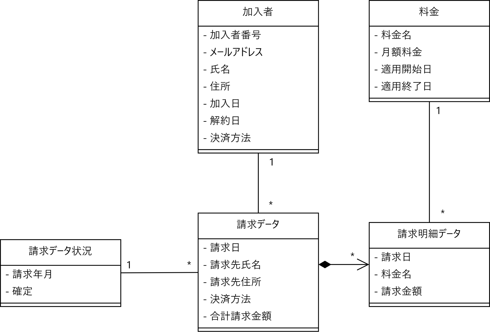
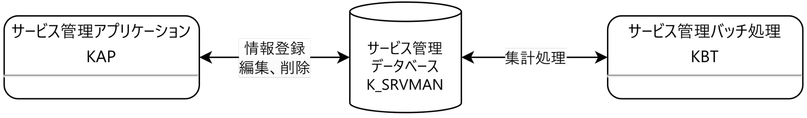
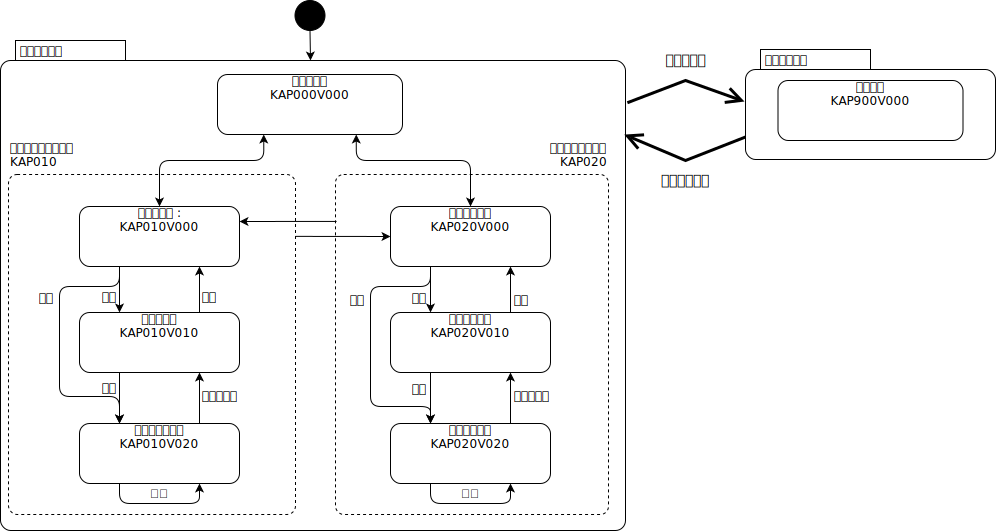
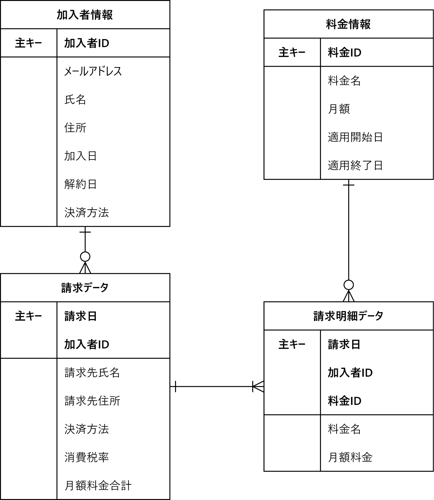

# 概要仕様書

## ユースケース

### 加入者情報管理機能

**加入者を登録する**

主アクター
:   管理者

事前条件
:   なし

主シナリオ
:   1. 管理者は、加入者登録画面を表示する
    2. サービス管理システムは、加入者登録画面を表示する
    3. 管理者は加入者情報を登録する。
    4. サービス管理システムは、加入者情報を保存する
    5. 管理者は、加入者情報を確認する

拡張シナリオ
:   4a. サービス管理システムは入力エラーを表示する

成功時保証
:   加入者情報がデータベースに登録される

---

**加入者を編集する**

主アクター
:   管理者

事前条件
:   加入者情報が登録済みであること

主シナリオ
:   1. 管理者は、加入者情報を検索する
    2. サービス管理システムは、加入者情報の一覧を名前基準に昇順で表示する。
    3. 管理者は、一覧から対象の加入者を選択する。
    4. サービス管理システムは加入者情報を表示する。
    5. 管理者は、加入者情報を修正する。
    6. サービス管理システムは、加入者情報を保存する。
    7. 管理者は、加入者情報を確認する

拡張シナリオ
:   6a. サービス管理システムは入力エラーを表示する

成功時保証
:   加入者情報が更新される

---

**加入者を削除する**

主アクター
:   管理者

事前条件
:   加入者情報が登録済みであること

主シナリオ
:   1. 管理者は、加入者情報を検索する
    2. サービス管理システムは、加入者情報の一覧を名前基準に昇順で表示する。
    3. 管理者は、一覧から対象の加入者を選択する。
    4. サービス管理システムは加入者情報を表示する。
    5. 管理者は、加入者情報を削除する。
    6. サービス管理システムは、加入者情報を保存する。
    7. 管理者は、加入者情報を確認する

拡張シナリオ
:   6a. サービス管理システムは入力エラーを表示する

成功時保証
:   加入者情報が削除される

### 料金管理機能

**料金情報を登録する**

主アクター
:   管理者

事前条件
:   登録対象が登録されていないこと

主シナリオ
:   1. 管理者は、基本料金登録画面を表示する
    2. サービス管理システムは、基本料金登録画面を表示する
    3. 管理者は料金情報を登録する。
    4. サービス管理システムは、料金情報を保存する
    5. 管理者は、料金情報を確認する

拡張シナリオ
:   4a. サービス管理システムは入力エラーを表示する

成功時保証
:   料金情報がデータベースに登録される

---

**料金情報を編集する**

主アクター
:   管理者

事前条件
:   料金情報が登録済みであること

主シナリオ
:   1. 管理者は、料金情報を検索する
    2. サービス管理システムは、料金情報の一覧を名前基準に昇順で表示する。
    3. 管理者は、一覧から対象の基本料金を選択する。
    4. サービス管理システムは料金情報を表示する。
    5. 管理者は、料金情報を修正する。
    6. サービス管理システムは、料金情報を保存する。
    7. 管理者は、料金情報を確認する

拡張シナリオ
:   6a. サービス管理システムは入力エラーを表示する

成功時保証
:   料金情報が更新される

---

**料金情報を削除する**

主アクター
:   管理者

事前条件
:   料金情報が登録済みであること

主シナリオ
:   1. 管理者は、料金情報を検索する
    2. サービス管理システムは、料金情報の一覧を名前基準に昇順で表示する。
    3. 管理者は、一覧から対象の基本料金を選択する。
    4. サービス管理システムは料金情報を表示する。
    5. 管理者は、料金情報を削除する。
    6. サービス管理システムは、料金情報を保存する。

拡張シナリオ
:   6a. サービス管理システムは入力エラーを表示する

成功時保証
:   料金情報が削除される

### 請求データ作成機能

**請求データを作成する**

主アクター
:   サービス管理システム

事前条件
:   このユースケースは毎月1日に1回実行されること

主シナリオ
:   1. サービス管理システムは、加入者ごと基本料金と追加オプション料金を集計し、請求データを作成する。
    2. 請求データおよび請求明細データテーブルにトランザクションとしてレコード追加する。
    3. サービス管理システムはトランザクションを確定する。

拡張シナリオ
:   2a. 処理中にエラーが発生した場合は中断し、トランザクションを破棄する。

成功時保証
:   当月分の請求データおよび請求明細データが作成される

## 概念モデル

ソース：[Java研修.drawio] → 概念モデルシート

## 外部設計

## サービス管理システムの関係性

- 全ての情報は、サービス管理データベース(K_SRVMAN)の各テーブルに格納される。

- データの閲覧、登録、修正は「サービス管理アプリケーション(KAP)」にて行う。

- 月次、日次など定期的に行う一括処理は「サービス管理バッチ処理(KBT)」にて行う。

## サービス管理アプリケーションのフロー

- 未ログインの場合は、各画面を表示する前にログイン画面を表示する。

- 画面上部の機能メニューからトップ画面や各情報の検索画面へ遷移できる。なお、画面に入力したデータは、画面が遷移するとすべて失われる。

## バッチ

詳細は[請求データ作成バッチ仕様書](03_batch_spec.md)を参照。

## データベース設計

### ER図

### テーブル定義

各テーブルの項目定義などの物理設計は、[データベーステーブル設計書](09_dbtable.md)を参照。
