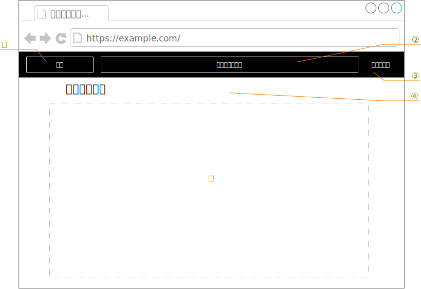
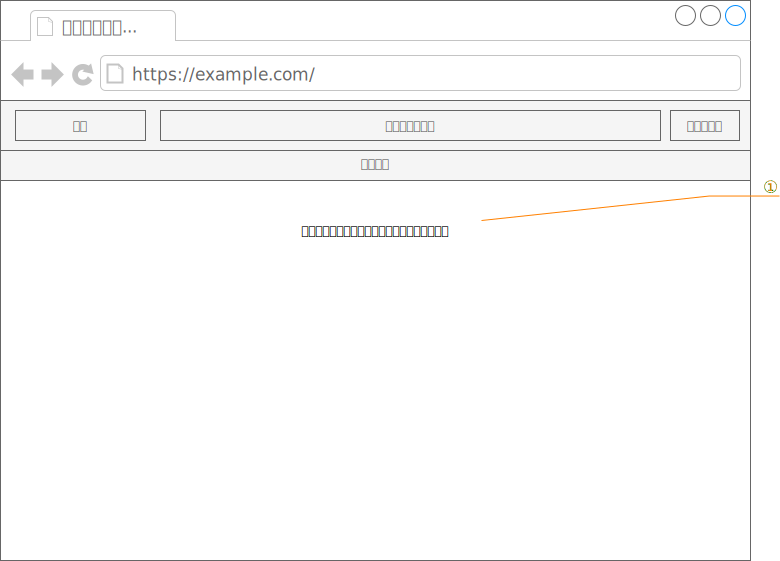
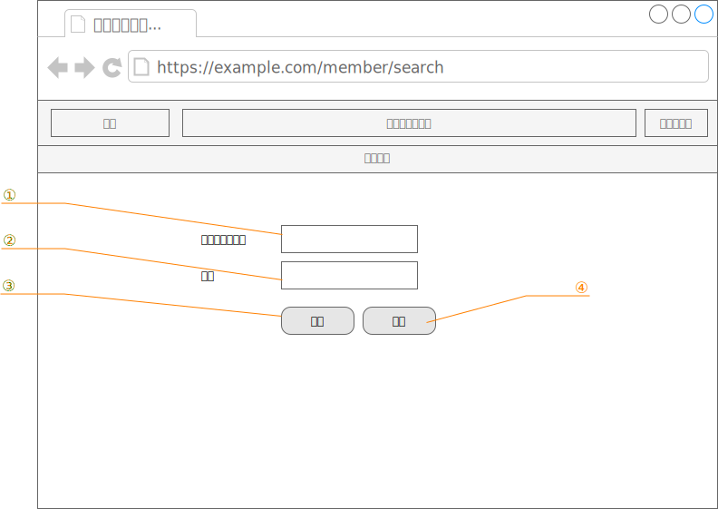
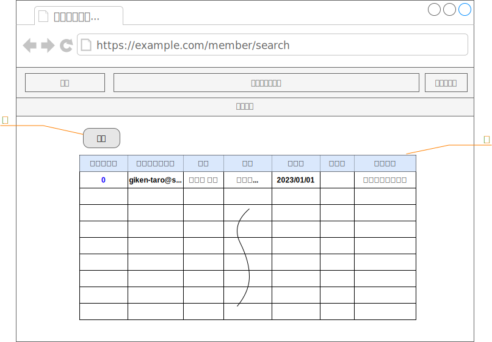
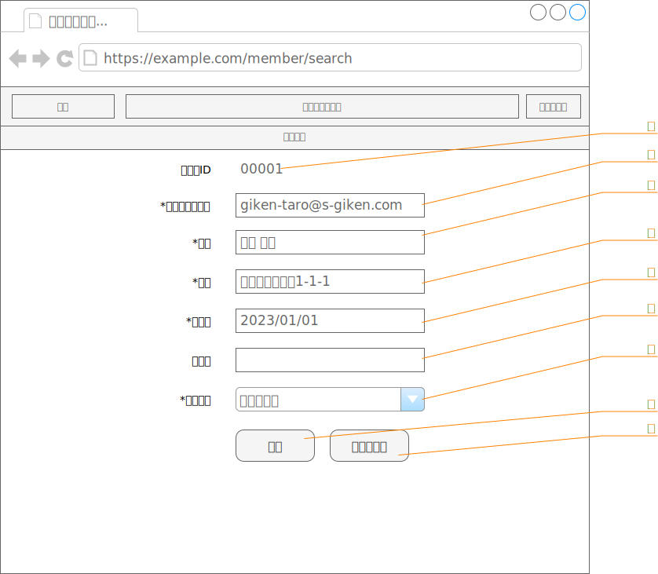
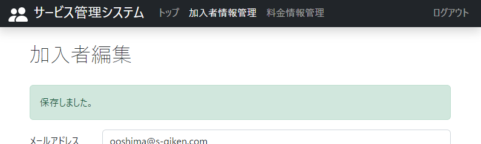
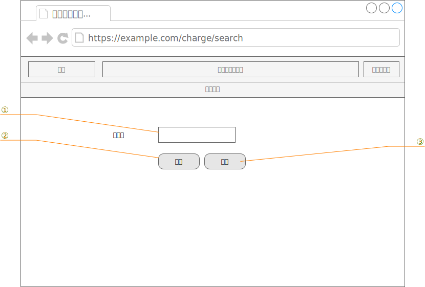
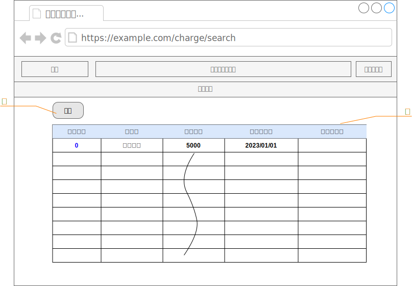
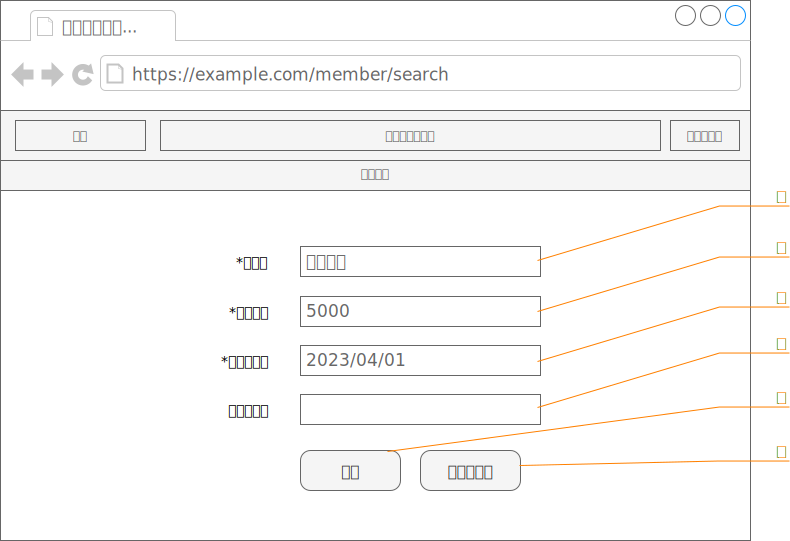

# 詳細設計

# ログイン画面

|              |              |
| ------------ | ------------ |
| 画面ID       | KAP900V000   |
| 画面名       | ログイン画面 |
| パス         | /login       |
| HTTPメソッド | GET          |

## 構成

| No  | 項目ID   | 項目名     | 項目タイプ | 制限 | 備考 |
| --- | -------- | ---------- | ---------- | ---- | ---- |
| ①   | message  | メッセージ | テキスト   |      |      |
| ②   | userId   | ユーザID   | テキスト   |      |      |
| ③   | password | パスワード | パスワード |      |      |
| ④   | login    | ログイン   | ボタン     |      |      |

## イベント・アクション

<table>
<colgroup>
<col style="width: 4%" />
<col style="width: 12%" />
<col style="width: 14%" />
<col style="width: 67%" />
</colgroup>
<thead>
<tr>
<th>No</th>
<th>項目ID</th>
<th>イベント</th>
<th style="text-align: left;">アクション</th>
</tr>
</thead>
<tbody>
<tr>
<td>1</td>
<td>login</td>
<td>クリック</td>
<td style="text-align: left;">
入力された「ユーザID」と「パスワード」をデータベースと照合する。

<ul>
<li>
一致した場合はセッションを確立し、「トップ画面」を表示する。
</li>
<li>
一致しなかった場合は、「message」にログインできなかった旨を表示する。
</li>
</ul></td>
</tr>
</tbody>
</table>

# 全画面共通のナビバーとタイトル

|              |                    |
| ------------ | ------------------ |
| 画面ID       | ―                  |
| 画面名       | ナビバーとタイトル |
| パス         | ―                  |
| HTTPメソッド | ―                  |

## 構成

<figure>

<figcaption>
表 2-1
</figcaption>
</figure>

| No  | 項目ID    | 項目名 | 項目タイプ    | 制限 | 備考                               |
| --- | --------- | ------ | ------------- | ---- | ---------------------------------- |
| ①   | logo      | ―      | リンク        | ―    | ロゴ画像とシステム名を固定表示する |
| ②   | functions | ―      | リンク        | ―    | 各機能へのリンク                   |
| ③   | logout    | ―      | リンク        | ―    | ログイン中のみ表示                 |
| ④   | title     | ―      | ラベル        | ―    |                                    |
| ⑤   | content   | ―      | ※ページの内容 | ―    |                                    |

## イベント・アクション

<table>
<colgroup>
<col style="width: 4%" />
<col style="width: 15%" />
<col style="width: 14%" />
<col style="width: 64%" />
</colgroup>
<thead>
<tr>
<th>No</th>
<th>項目ID</th>
<th>イベント</th>
<th style="text-align: left;">アクション</th>
</tr>
</thead>
<tbody>
<tr>
<td>1</td>
<td>logo</td>
<td>クリック</td>
<td style="text-align: left;">
トップページ(/)に遷移する。

なお、入力していた内容は破棄される。
</td>
</tr>
<tr>
<td>2</td>
<td>funtions</td>
<td>クリック</td>
<td style="text-align: left;">
各機能に遷移する。なお、入力していた内容は破棄される。

<ul>
<li>
トップ → トップページ(/) へ遷移する
</li>
<li>
加入者管理 → 加入者検索結果一覧画面(/member/search)へ遷移する。
</li>
<li>
料金管理 → 料金情報検索条件画面(/charge/search)へ遷移する。
</li>
</ul></td>
</tr>
<tr>
<td>3</td>
<td>logout</td>
<td>クリック</td>
<td style="text-align: left;">
※ログイン中のみクリック可能

ログアウト処理を行い、ログインページ(/login)に遷移する。

なお、入力していた内容は破棄される。
</td>
</tr>
</tbody>
</table>

# トップ画面

|              |            |
| ------------ | ---------- |
| 画面ID       | KA000V000  |
| 画面名       | トップ画面 |
| パス         | /top       |
| HTTPメソッド | GET        |

## 構成

| No  | 項目ID | 項目名 | 項目タイプ | 制限 | 備考                       |
| --- | ------ | ------ | ---------- | ---- | -------------------------- |
| ①   | ―      | ―      | ラベル     | ―    | 固定メッセージを表示する。 |

## イベント・アクション

※とくになし

# 加入者検索条件画面

|              |                |
| ------------ | -------------- |
| 画面ID       | KA010V000      |
| 画面名       | 加入者検索条件 |
| パス         | /member/search |
| HTTPメソッド | GET            |

## 構成

| No  | 項目ID     | 項目名         | 項目タイプ | 制限 | 備考 |
| --- | ---------- | -------------- | ---------- | ---- | ---- |
| ①   | mail       | メールアドレス | テキスト   | ―    |      |
| ②   | name       | 氏名           | テキスト   | ―    |      |
| ③   | search     | 検索           | ボタン     | ―    |      |
| ④   | addAccount | 登録           | ボタン     | ―    |      |

## イベント・アクション

| No  | 項目ID     | イベント | アクション                                                                                                                                                                                                                            |
| --- | ---------- | -------- | :------------------------------------------------------------------------------------------------------------------------------------------------------------------------------------------------------------------------------------ |
| 1   | search     | クリック | 入力された「メールアドレス」と「氏名」から、加入者情報から部分検索し、一致する加入者情報を「[加入者検索結果一覧画面][9]」として表示する。なお、「メールアドレス」と「氏名」両方指定された場合は、両者に一致する加入者情報を抽出する。 |
| 2   | addAccount | クリック | 追加モードで「[加入者編集画面][10]」を表示する。                                                                                                                                                                                      |

# 加入者検索結果一覧画面

|              |                        |
| ------------ | ---------------------- |
| 画面ID       | KA010V010              |
| 画面名       | 加入者検索結果一覧画面 |
| パス         | /member/search         |
| HTTPメソッド | POST                   |

## 加入者情報検索処理

送信されたメールアドレス(mail)と名前(name)の検索条件それぞれが部分一致するレコードを、同名の列を持つ加入者情報から取得する。なお、

- 検索条件がすべて空だった時は、加入者情報からすべてのレコードを抽出する。

- 検索条件が複数設定されている場合は、それぞれの条件がすべて真となるレコードを抽出する。

## 構成

| No  | 項目ID | 項目名           | 項目タイプ | 制限/書式  | 備考                                     |
| --- | ------ | ---------------- | ---------- | ---------- | ---------------------------------------- |
| ①   | back   | 戻る             | ボタン     | ―          |                                          |
| ②   | result | 検索結果一覧     | テーブル   | ―          | 行数制限なし                             |
|     | (項目) | 　加入者番号     | リンク     | ―          | クリックすると加入者情報編集画面を表示。 |
|     |        | 　メールアドレス | テキスト   | ―          |                                          |
|     |        | 　氏名           | テキスト   | ―          |                                          |
|     |        | 　住所           | テキスト   | ―          |                                          |
|     |        | 　加入日         | テキスト   | YYYY/MM/DD |                                          |
|     |        | 　解約日         | テキスト   | YYYY/MM/DD |                                          |
|     |        | 　支払方法       | テキスト   | ―          |                                          |

## イベント・アクション

<table>
<colgroup>
<col style="width: 5%" />
<col style="width: 14%" />
<col style="width: 14%" />
<col style="width: 64%" />
</colgroup>
<thead>
<tr>
<th>No</th>
<th>項目ID</th>
<th>イベント</th>
<th>アクション</th>
</tr>
</thead>
<tbody>
<tr>
<td>1</td>
<td>
resultの

加入者番号
</td>
<td>クリック</td>
<td>加入者番号に対応する加入者情報の<a href="#加入者編集画面">加入者編集画面</a>を表示する。</td>
</tr>
</tbody>
</table>

# 加入者編集画面

<table style="width:99%;">
<colgroup>
<col style="width: 17%" />
<col style="width: 81%" />
</colgroup>
<tbody>
<tr>
<td>画面ID</td>
<td>KA010V020</td>
</tr>
<tr>
<td>画面名</td>
<td>加入者編集画面</td>
</tr>
<tr>
<td>パス</td>
<td>
追加モード：/member/add

編集モード：/member/edit/{id} {id} ... 加入者ID
</td>
</tr>
<tr>
<td>HTTPメソッド</td>
<td>共通：GET</td>
</tr>
</tbody>
</table>

## モード

本画面にはモードが存在する。

- 追加モード … 加入者情報と適用料金情報を新たに追加するモード。入力可能な項目はすべて空欄にして表示します。

- 編集モード … 指定された加入者IDを持つ加入者情報と適用料金情報を編集するモード。加入者IDに該当する加入者情報と適用料金情報を取得して、入力可能は項目にセットして表示します。

## 構成

<table>
<colgroup>
<col style="width: 4%" />
<col style="width: 15%" />
<col style="width: 18%" />
<col style="width: 18%" />
<col style="width: 20%" />
<col style="width: 21%" />
</colgroup>
<thead>
<tr>
<th>No</th>
<th>項目ID</th>
<th>項目名</th>
<th>項目タイプ</th>
<th>制限/書式</th>
<th>備考</th>
</tr>
</thead>
<tbody>
<tr>
<td>①</td>
<td>memberId</td>
<td>加入者ID</td>
<td>隠し要素</td>
<td>―</td>
<td></td>
</tr>
<tr>
<td>②</td>
<td>mail</td>
<td>メールアドレス</td>
<td>テキスト</td>
<td>
空欄不可、

1～255文字
</td>
<td></td>
</tr>
<tr>
<td>③</td>
<td>name</td>
<td>氏名</td>
<td>テキスト</td>
<td>
空欄不可、

1～31文字
</td>
<td></td>
</tr>
<tr>
<td>④</td>
<td>address</td>
<td>住所</td>
<td>テキスト</td>
<td>
空欄不可、

1～127文字
</td>
<td></td>
</tr>
<tr>
<td>⑤</td>
<td>joinAt</td>
<td>加入日</td>
<td>日付</td>
<td>
空欄不可

YYYY/MM/DD
</td>
<td></td>
</tr>
<tr>
<td>⑥</td>
<td>retireAt</td>
<td>解約日</td>
<td>日付</td>
<td>YYYY/MM/DD</td>
<td></td>
</tr>
<tr>
<td>⑦</td>
<td>chargeMethod</td>
<td>決済方法</td>
<td>ドロップダウン</td>
<td></td>
<td>
「クレジット決済」

「銀行振込」

のいずれか
</td>
</tr>
<tr>
<td>⑧</td>
<td>submit</td>
<td>保存</td>
<td>ボタン</td>
<td>―</td>
<td></td>
</tr>
<tr>
<td>⑨</td>
<td>cancel</td>
<td>キャンセル</td>
<td>ボタン</td>
<td>―</td>
<td></td>
</tr>
</tbody>
</table>

## イベント・アクション

<table>
<colgroup>
<col style="width: 4%" />
<col style="width: 15%" />
<col style="width: 14%" />
<col style="width: 64%" />
</colgroup>
<thead>
<tr>
<th>No</th>
<th>項目ID</th>
<th>イベント</th>
<th style="text-align: left;">アクション</th>
</tr>
</thead>
<tbody>
<tr>
<td>1</td>
<td>submit</td>
<td>クリック</td>
<td style="text-align: left;">
＜追加モード時＞

入力された情報を、加入者情報と適用料金情報に追加する。

正常に完了したら、登録した情報を設定した「<a href="#加入者編集画面">加入者編集画面</a>」を編集モードで表示する。

また、正常に料金情報が追加された場合は、タイトル下部に「保存しました」とメッセージを表示する。

入力内容に誤りがあり、加入者情報の変更に失敗した場合は、以下の画像の通り、エラーのある項目の入力欄のそばにエラー内容を表示する。

＜編集モード時＞

入力された情報を加入者情報と適用料金情報に対して更新する。なお、新たに料金情報を後から追加した場合など、適用料金情報に更新する情報がない場合は、追加する。

正常に完了したら、登録した情報を設定した「<a href="#加入者編集画面">加入者編集画面</a>」を編集モードで表示する。

また、正常に加入者情報が追加された場合は、タイトル下部に「保存しました」とメッセージを表示する。

　※ 動作は追加モードと同様 
入力内容に誤りがあり、加入者情報の変更に失敗した場合は、エラーのある項目の入力欄のそばにエラー内容を表示する。

　※ 追加モードと同様
</td>
</tr>
<tr>
<td style="text-align: left;">2</td>
<td style="text-align: left;">cancel</td>
<td style="text-align: left;">クリック</td>
<td style="text-align: left;">入力された情報を破棄し、<a href="#加入者検索条件画面">加入者検索条件画面</a>に遷移する。</td>
</tr>
</tbody>
</table>

# 料金情報検索条件画面

|              |                      |
| ------------ | -------------------- |
| 画面ID       | KA020V000            |
| 画面名       | 料金情報検索条件画面 |
| パス         | /charge/search       |
| HTTPメソッド | GET                  |

## 構成

| No  | 項目ID     | 項目名   | 項目タイプ | 制限 | 備考 |
| --- | ---------- | -------- | ---------- | ---- | ---- |
| ①   | name       | 料金名   | テキスト   | ―    |      |
| ②   | search     | 検索     | ボタン     | ―    |      |
| ③   | addAccount | 新規作成 | ボタン     | ―    |      |

## イベント・アクション

| No  | 項目ID     | イベント | アクション                                                                                           |
| --- | ---------- | -------- | ---------------------------------------------------------------------------------------------------- |
| 1   | search     | クリック | 入力された「氏名」を条件に料金情報から部分検索し、その結果を「[料金検索結果一覧画面][16]」に表示する |
| 2   | addAccount | クリック | 追加モードで「[加入者編集画面][10]」を表示する。                                                     |

# 料金検索結果一覧画面

|              |                      |
| ------------ | -------------------- |
| 画面ID       | KA020V010            |
| 画面名       | 料金検索結果一覧画面 |
| パス         | /charge/search       |
| HTTPメソッド | POST                 |

## 加入者情報検索処理

送信された料金名(name)に部分一致するレコードを、料金情報から抽出する。なお、検索条件がすべて空だった時は、料金情報からすべてのレコードを抽出する。

## 構成

| No  | 項目ID | 項目名       | 項目タイプ | 制限/書式  | 備考           |
| --- | ------ | ------------ | ---------- | ---------- | -------------- |
| ①   | back   | 戻る         | ボタン     | ―          |                |
| ②   | result | 検索結果一覧 | テーブル   | ―          | 行数制限なし   |
|     | (項目) | 　料金番号   | リンク     | ―          | クリックすると |
|     |        | 　料金名     | テキスト   | ―          |                |
|     |        | 　月額料金   | テキスト   | ―          |                |
|     |        | 　適用開始日 | テキスト   | YYYY/MM/DD |                |
|     |        | 　適用終了日 | テキスト   | YYYY/MM/DD |                |

## イベント・アクション

<table>
<colgroup>
<col style="width: 5%" />
<col style="width: 14%" />
<col style="width: 14%" />
<col style="width: 64%" />
</colgroup>
<thead>
<tr>
<th>No</th>
<th>項目ID</th>
<th>イベント</th>
<th>アクション</th>
</tr>
</thead>
<tbody>
<tr>
<td>1</td>
<td>
resultの

料金番号
</td>
<td>クリック</td>
<td>料金番号に対応する料金情報の<a href="#料金情報編集画面">料金情報編集画面</a>を表示する。</td>
</tr>
</tbody>
</table>

# 料金情報編集画面

<table style="width:99%;">
<colgroup>
<col style="width: 17%" />
<col style="width: 81%" />
</colgroup>
<tbody>
<tr>
<td>画面ID</td>
<td>KA030V020</td>
</tr>
<tr>
<td>画面名</td>
<td>料金情報編集画面</td>
</tr>
<tr>
<td>パス</td>
<td>
追加モード：/charge/add

編集モード：/charge/edit/{id} ※{id} ... 料金ID
</td>
</tr>
<tr>
<td>HTTPメソッド</td>
<td>共通：GET</td>
</tr>
</tbody>
</table>

## モード

本画面にはモードが存在する。

- 追加モード … 料金情報を新たに追加するモード。入力可能な項目はすべて空欄にして表示します。

- 編集モード … 指定された料金番号を持つ料金情報を編集するモード。料金IDに該当する料金情報を取得して、入力項目に設定して表示します。

## 構成

<table>
<colgroup>
<col style="width: 4%" />
<col style="width: 15%" />
<col style="width: 18%" />
<col style="width: 19%" />
<col style="width: 24%" />
<col style="width: 17%" />
</colgroup>
<thead>
<tr>
<th>No</th>
<th>項目ID</th>
<th>項目名</th>
<th>項目タイプ</th>
<th>制限/書式</th>
<th>備考</th>
</tr>
</thead>
<tbody>
<tr>
<td>②</td>
<td>name</td>
<td>料金名</td>
<td>テキスト</td>
<td>空欄不可</td>
<td></td>
</tr>
<tr>
<td>③</td>
<td>amount</td>
<td>料金</td>
<td>テキスト</td>
<td>
空欄不可、数字のみ

0～999999999
</td>
<td></td>
</tr>
<tr>
<td>④</td>
<td>startDate</td>
<td>適用開始日</td>
<td>日付</td>
<td>
空欄不可

YYYY/MM/DD
</td>
<td></td>
</tr>
<tr>
<td>⑤</td>
<td>endDate</td>
<td>適用終了日</td>
<td>日付</td>
<td>YYYY/MM/DD</td>
<td></td>
</tr>
<tr>
<td>⑥</td>
<td>submit</td>
<td>保存</td>
<td>ボタン</td>
<td>―</td>
<td></td>
</tr>
<tr>
<td>⑦</td>
<td>cancel</td>
<td>キャンセル</td>
<td>ボタン</td>
<td>―</td>
<td></td>
</tr>
</tbody>
</table>

## イベント・アクション

<table>
<colgroup>
<col style="width: 4%" />
<col style="width: 15%" />
<col style="width: 14%" />
<col style="width: 64%" />
</colgroup>
<thead>
<tr>
<th>No</th>
<th>項目ID</th>
<th>イベント</th>
<th>アクション</th>
</tr>
</thead>
<tbody>
<tr>
<td>1</td>
<td>submit</td>
<td>クリック</td>
<td>
＜追加モード時＞

入力された情報を料金情報に追加する。

正常に完了したら、登録した情報を各入力項目に設定した「<a href="#料金情報編集画面">加入者編集画面</a>」を編集モードで表示する。

また、正常に料金情報が追加された場合は、タイトル下部に「保存しました」とメッセージを表示する。

入力内容にエラーがある場合は、以下の画像の通り、エラーのある項目の入力欄のそばにエラー内容を表示する。

＜編集モード時＞

入力された情報で料金情報を更新する。

正常に完了したら、登録した情報を各入力項目に設定した「<a href="#料金情報編集画面">加入者編集画面</a>」を編集モードで表示する。

また、正常に料金情報が変更できた場合はタイトル下部に「保存しました」とメッセージを表示する。

　※ 追加モード時と同様

入力内容にエラーがある場合は、エラーのある項目の入力欄のそばにエラー内容を表示する。

※ 追加モード時と同様
</td>
</tr>
<tr>
<td>2</td>
<td>cancel</td>
<td>クリック</td>
<td>入力された情報を破棄し、<a href="#料金情報検索条件画面">料金情報検索条件画面</a>に遷移する。</td>
</tr>
</tbody>
</table>

[3]: #ログイン画面
[1]: #構成
[2]: #イベントアクション
[4]: #全画面共通のナビバーとタイトル
[5]: #構成-1
[5]: #イベントアクション-1
[6]: #トップ画面
[7]: #構成-2
[8]: #イベントアクション-2
[7]: #加入者検索条件画面
[9]: #構成-3
[8]: #イベントアクション-3
[9]: #加入者検索結果一覧画面
[10]: #加入者情報検索処理
[11]: #構成-4
[10]: #イベントアクション-4
[11]: #加入者編集画面
[12]: #モード
[12]: #構成-5
[13]: #イベントアクション-5
[14]: #料金情報検索条件画面
[15]: #構成-6
[16]: #_Toc142290522
[16]: #料金検索結果一覧画面
[17]: #加入者情報検索処理-1
[18]: #構成-7
[17]: #イベントアクション-7
[18]: #料金情報編集画面
[19]: #モード-1
[19]: #構成-8
[20]: #イベントアクション-8
