# 画面仕様書

## UI設計ポリシー

### 前提条件

本システムのクライアントにはWebブラウザを用いる。

| 対応ブラウザ     | 最新のMicrosoft Edge、Google Chrome、Firefox |
|------------------|----------------------------------------------|
| 画面レイアウト幅 | ブラウザに合わせて可変とする。               |
| 文字コード       | UTF-8                                        |

### 画面レイアウト

本システムの画面レイアウトは、次の通りとする。なお、背景色は領域を表す

| ヘッダー     | システムロゴ、機能メニュー、ログイン名を表示します         |
|--------------|------------------------------------------------------------|
| 機能メニュー | クリックすると各機能へ移動するリンクを列挙して表示します。 |
| ログアウト   | クリックするとログアウトするリンクを表示します。           |
| タイトル     | 機能のタイトルを表示します                                 |
| 機能のボディ | 各機能の内容を表示します                                   |

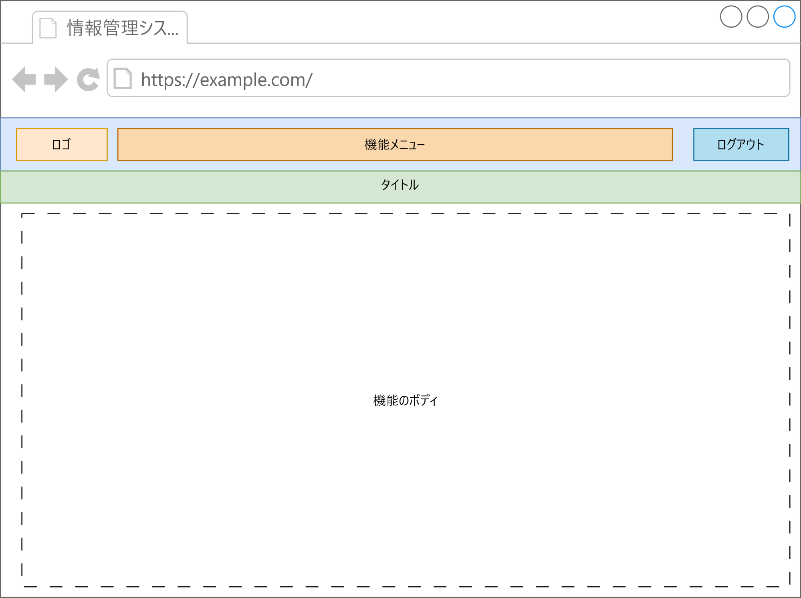

### 画面機能レイアウトパターン

| 検索条件入力画面 | 情報を検索する際の条件を入力する画面パターン |
|------------------|----------------------------------------------|
| 検索結果一覧画面 | 情報の検索結果を一覧で表示する画面パターン   |
| 情報編集画面     | 情報を編集する画面パターン                   |

#### 検索条件入力画面

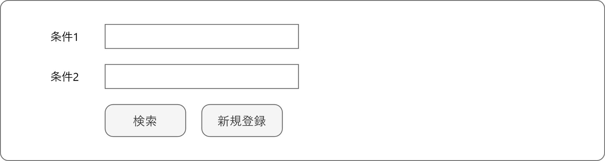

- 左側に検索条件としたい項目を、項目名と入力欄でセットとして、1セットずつ表示し、最後に検索ボタンを表示する。

- 検索ボタンの右側に、新規登録ボタンを配置する。

#### 検索結果一覧画面

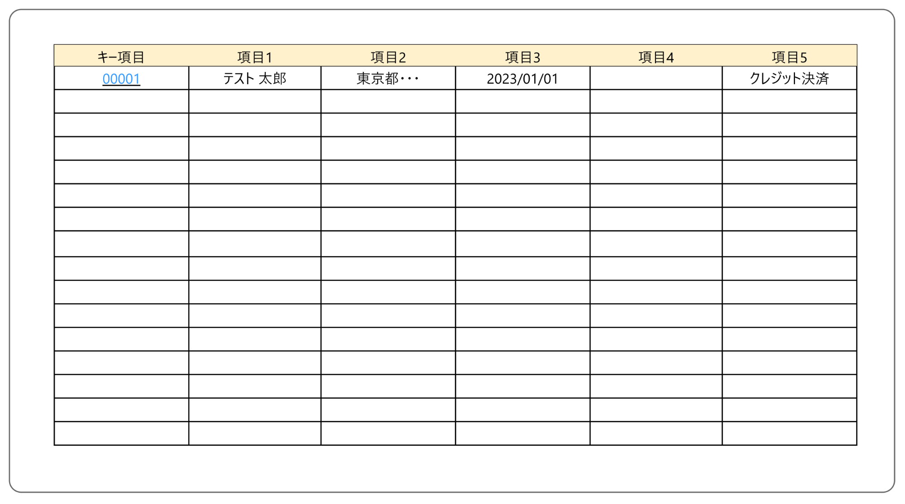

- 検索条件に一致する結果を1レコードずつ表形式で表示する。

- キー列の情報をクリックすることで、編集画面を表示できるようにする。

#### 情報編集画面

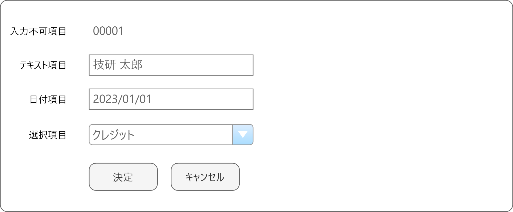

- 編集対象となる情報の項目は、項目名と適切な入力欄とセットにして、1行に1セット表示する。

- 最後の行に、「保存」ボタンと「キャンセル」ボタンを表示する。

### 項目パターン

本システム内で使用される情報の各項目における入力時、表示時の取扱いについては次の通りとする。

<table>
<caption></caption>
<colgroup>
<col style="width: 19%" />
<col style="width: 8%" />
<col style="width: 71%" />
</colgroup>
<tbody>
<tr>
<td rowspan="2">加入者番号</td>
<td>入力</td>
<td>テキストで入力する</td>
</tr>
<tr>
<td>表示</td>
<td>テキストで表示する</td>
</tr>
<tr>
<td rowspan="2">メールアドレス</td>
<td>入力</td>
<td>テキストで入力する</td>
</tr>
<tr>
<td>表示</td>
<td>テキストで表示する</td>
</tr>
<tr>
<td rowspan="2">氏名</td>
<td>入力</td>
<td>テキストで入力する</td>
</tr>
<tr>
<td>表示</td>
<td>テキストで表示する</td>
</tr>
<tr>
<td rowspan="2">住所</td>
<td>入力</td>
<td>都道府県、市町村、番地、建物等をまとめてテキストで入力する</td>
</tr>
<tr>
<td>表示</td>
<td>テキストで表示する</td>
</tr>
<tr>
<td rowspan="2">加入日</td>
<td>入力</td>
<td>テキスト入力または、カレンダーピックで入力する</td>
</tr>
<tr>
<td>表示</td>
<td>テキストで表示する</td>
</tr>
<tr>
<td rowspan="2">解約日</td>
<td>入力</td>
<td>テキスト入力または、カレンダーピックで入力する</td>
</tr>
<tr>
<td>表示</td>
<td>YYYY/MM/DD形式のテキストで表示する</td>
</tr>
<tr>
<td rowspan="2">決済方法</td>
<td>入力</td>
<td>チェックボックスのリストで入力する。</td>
</tr>
<tr>
<td>表示</td>
<td>テキストで表示する</td>
</tr>
<tr>
<td rowspan="2">料金番号</td>
<td>入力</td>
<td>テキストで入力する</td>
</tr>
<tr>
<td>表示</td>
<td>テキストで表示する</td>
</tr>
<tr>
<td rowspan="2">料金名</td>
<td>入力</td>
<td>テキストで入力する</td>
</tr>
<tr>
<td>表示</td>
<td>テキストで表示する</td>
</tr>
<tr>
<td rowspan="2">月額料金</td>
<td>入力</td>
<td>テキストで入力する。</td>
</tr>
<tr>
<td>表示</td>
<td>3桁カンマ区切りのテキストで表示する。</td>
</tr>
<tr>
<td rowspan="2">適用開始日</td>
<td>入力</td>
<td>テキスト入力または、カレンダーピックで入力する</td>
</tr>
<tr>
<td>表示</td>
<td>YYYY/MM/DD形式のテキストで表示する</td>
</tr>
<tr>
<td rowspan="2">適用終了日</td>
<td>入力</td>
<td>テキスト入力または、カレンダーピックで入力する</td>
</tr>
<tr>
<td>表示</td>
<td>YYYY/MM/DD形式のテキストで表示する</td>
</tr>
</tbody>
</table>

### 入力制限一覧

本システム内で使用される情報の各項目における入力時、表示時の取扱いについては次の通りとする。

| 項目名         | デフォルト | 最小文字数 | 最大文字数 | 利用可能文字・形式       |
|----------------|------------|------------|------------|--------------------------|
| メールアドレス | 空欄       | 1          | 255        | メールアドレス           |
| 氏名           | 空欄       | 1          | 31         | 半角英字、全角、スペース |
| 住所           | 空欄       | 1          | 127        | 半角英字、全角、スペース |
| 加入日         | 空欄       | 10         | 10         | 半角数字、スラッシュ     |
| 解約日         | 空欄       | 10         | 10         | 半角数字、スラッシュ     |
| 決済方法       | 空欄       | ―          | ―          | ―                        |
| 料金名         | 空欄       | 1          | 127        | 半角英字、全角、スペース |
| 料金           | 空欄       | 1          | 9          | 半角数字                 |
| 適用開始日     | 空欄       | 10         | 10         | 半角数字、スラッシュ     |
| 適用終了日     | 空欄       | 10         | 10         | 半角数字、スラッシュ     |

### 共通レイアウト（ナビバー・タイトル）

全画面共通で表示されるナビバーとタイトル領域の仕様を示す。

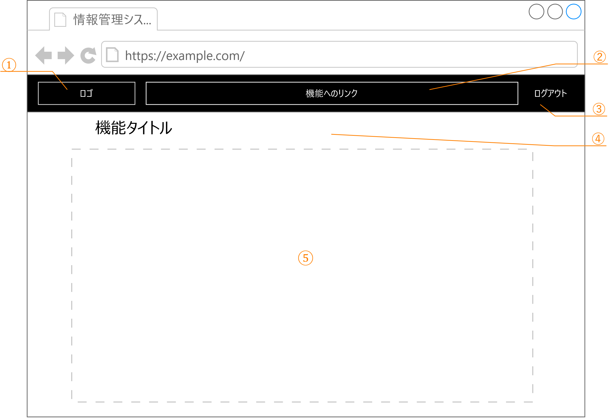

| No  | 項目ID    | 項目名 | 項目タイプ    | 制限 | 備考                               |
| --- | --------- | ------ | ------------- | ---- | ---------------------------------- |
| ①  | logo      | ―      | リンク       | ―   | ロゴ画像とシステム名を固定表示する |
| ②  | functions | ―      | リンク       | ―   | 各機能へのリンク                   |
| ③  | logout    | ―      | リンク       | ―   | ログイン中のみ表示                 |
| ④  | title     | ―      | ラベル       | ―   |                                    |
| ⑤  | content   | ―      | ※ページの内容 | ― |                                    |

#### イベント・アクション

##### logo（クリック）

トップページ(/)に遷移する。なお、入力していた内容は破棄される。

##### functions（クリック）

各機能に遷移する。なお、入力していた内容は破棄される。

- トップ → トップページ(/) へ遷移する
- 加入者管理 → 加入者検索結果一覧画面(/member/search)へ遷移する。
- 料金管理 → 料金情報検索条件画面(/charge/search)へ遷移する。

##### logout（クリック）

※ログイン中のみクリック可能

ログアウト処理を行い、ログインページ(/login)に遷移する。なお、入力していた内容は破棄される。

## ログイン画面

画面ID
:   `KAP900V000`

パス
:   `/login`

HTTPメソッド
:   `GET`

### 構成

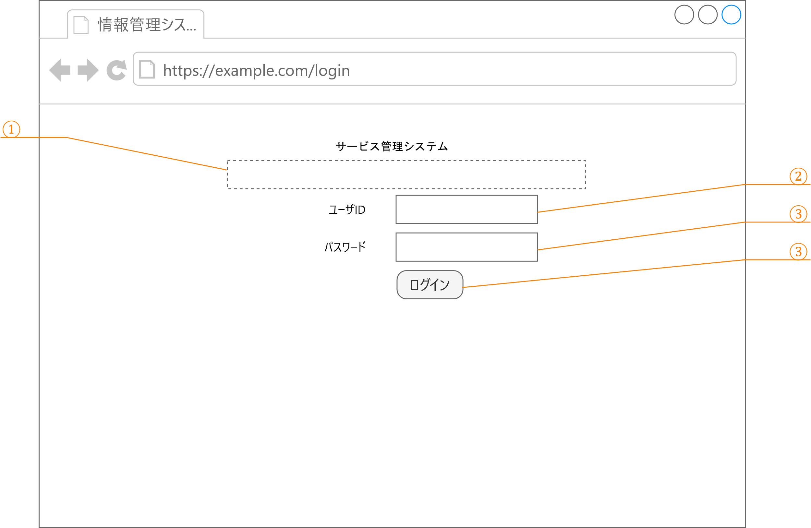

| No  | 項目ID   | 項目名     | 項目タイプ | 制限 | 備考 |
| --- | -------- | ---------- | ---------- | ---- | ---- |
| ①  | message  | メッセージ | テキスト   |      |      |
| ②  | userId   | ユーザID   | テキスト   |      |      |
| ③  | password | パスワード | パスワード |      |      |
| ④  | login    | ログイン   | ボタン     |      |      |

### イベント・アクション

#### login（クリック）

入力された「ユーザID」と「パスワード」をデータベースと照合する。

- 一致した場合はセッションを確立し、「トップ画面」を表示する。
- 一致しなかった場合は、「message」にログインできなかった旨を表示する。

## トップ画面

画面ID
:   `KA000V000`

パス
:   `/top`

HTTPメソッド
:   `GET`

### 構成

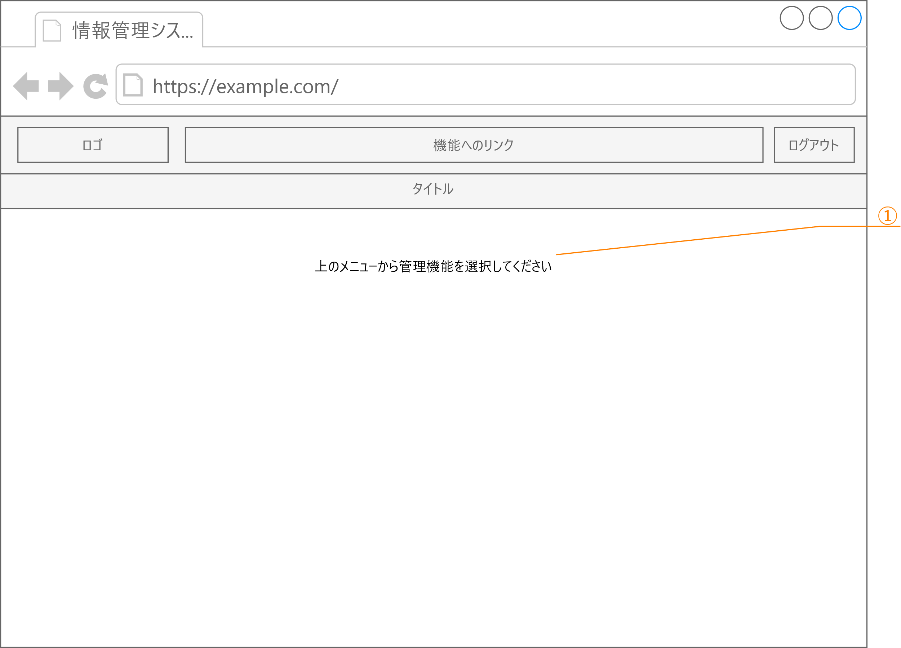

| No  | 項目ID | 項目名 | 項目タイプ | 制限 | 備考                       |
| --- | ------ | ------ | ---------- | ---- | -------------------------- |
| ①  | ―     | ―     | ラベル     | ―   | 固定メッセージを表示する。 |

### イベント・アクション

※とくになし

## 加入者検索条件画面

画面ID
:   `KA010V000`

パス
:   `/member/search`

HTTPメソッド
:   `GET`

### 構成

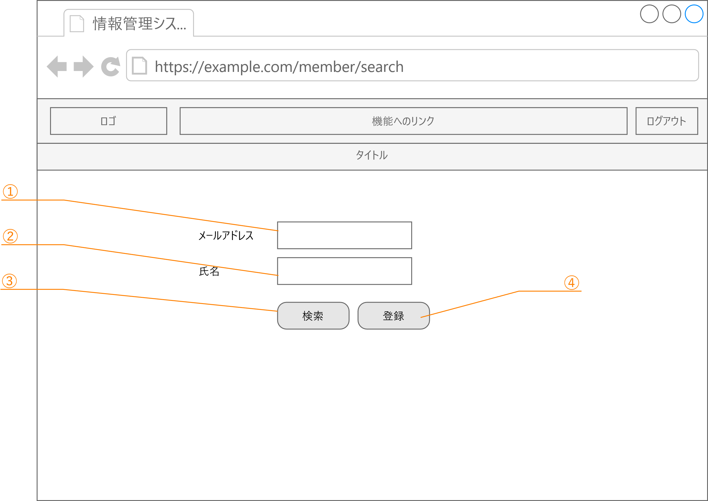

| No  | 項目ID     | 項目名         | 項目タイプ | 制限 | 備考 |
| --- | ---------- | -------------- | ---------- | ---- | ---- |
| ①  | mail       | メールアドレス | テキスト   | ―    |      |
| ②  | name       | 氏名           | テキスト   | ―    |      |
| ③  | search     | 検索           | ボタン     | ―    |      |
| ④  | addAccount | 登録           | ボタン     | ―    |      |

### イベント・アクション

#### search（クリック）

入力された「メールアドレス」と「氏名」から、加入者情報から部分検索し、一致する加入者情報を「[加入者検索結果一覧画面][9]」として表示する。なお、「メールアドレス」と「氏名」両方指定された場合は、両者に一致する加入者情報を抽出する。

#### addAccount（クリック）

追加モードで「[加入者編集画面][10]」を表示する。

## 加入者検索結果一覧画面

画面ID
:   `KA010V010`

パス
:   `/member/search`

HTTPメソッド
:   `POST`

### 加入者情報検索処理

送信されたメールアドレス(mail)と名前(name)の検索条件それぞれが部分一致するレコードを、同名の列を持つ加入者情報から取得する。なお、

- 検索条件がすべて空だった時は、加入者情報からすべてのレコードを抽出する。

- 検索条件が複数設定されている場合は、それぞれの条件がすべて真となるレコードを抽出する。

### 構成

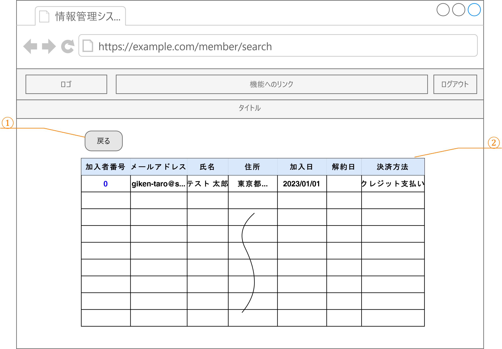

| No  | 項目ID | 項目名           | 項目タイプ | 制限/書式  | 備考                                     |
| --- | ------ | ---------------- | ---------- | ---------- | ---------------------------------------- |
| ①  | back   | 戻る             | ボタン     | ―          |                                          |
| ②  | result | 検索結果一覧     | テーブル   | ―          | 行数制限なし                             |
|     | (項目) | 　加入者番号     | リンク     | ―          | クリックすると加入者情報編集画面を表示。 |
|     |        | 　メールアドレス | テキスト   | ―          |                                          |
|     |        | 　氏名           | テキスト   | ―          |                                          |
|     |        | 　住所           | テキスト   | ―          |                                          |
|     |        | 　加入日         | テキスト   | YYYY/MM/DD |                                          |
|     |        | 　解約日         | テキスト   | YYYY/MM/DD |                                          |
|     |        | 　支払方法       | テキスト   | ―          |                                          |

### イベント・アクション

#### resultの加入者番号（クリック）

加入者番号に対応する加入者情報の**加入者編集画面**を表示する。

## 加入者編集画面

画面ID
:   `KA010V020`

パス
:   - 追加モード：`/member/add`
    - 編集モード：`/member/edit/{id}` {id} ... 加入者ID

HTTPメソッド
:   `共通：GET`

### モード

本画面にはモードが存在する。

- 追加モード … 加入者情報と適用料金情報を新たに追加するモード。入力可能な項目はすべて空欄にして表示します。

- 編集モード … 指定された加入者IDを持つ加入者情報と適用料金情報を編集するモード。加入者IDに該当する加入者情報と適用料金情報を取得して、入力可能は項目にセットして表示します。

### 構成

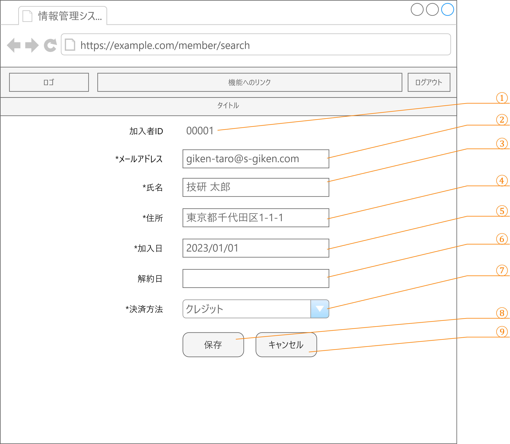

| No | 項目ID       | 項目名         | 項目タイプ     | 制限/書式              | 備考                                     |
| -- | ------------ | -------------- | -------------- | ---------------------- | ---------------------------------------- |
| ① | memberId     | 加入者ID       | 隠し要素       | ―                      |                                          |
| ② | mail         | メールアドレス | テキスト       | 空欄不可、1～255文字   |                                          |
| ③ | name         | 氏名           | テキスト       | 空欄不可、1～31文字    |                                          |
| ④ | address      | 住所           | テキスト       | 空欄不可、1～127文字   |                                          |
| ⑤ | joinAt       | 加入日         | 日付           | 空欄不可、YYYY/MM/DD   |                                          |
| ⑥ | retireAt     | 解約日         | 日付           | YYYY/MM/DD             |                                          |
| ⑦ | chargeMethod | 決済方法       | ドロップダウン |                        | 「クレジット決済」「銀行振込」のいずれか |
| ⑧ | submit       | 保存           | ボタン         | ―                      |                                          |
| ⑨ | cancel       | キャンセル     | ボタン         | ―                      |                                          |

### イベント・アクション

#### submit（クリック）

＜追加モード時＞

入力された情報を、加入者情報と適用料金情報に追加する。正常に完了したら、登録した情報を設定した「**加入者編集画面**」を編集モードで表示する。

また、正常に料金情報が追加された場合は、タイトル下部に「保存しました」とメッセージを表示する。

入力内容に誤りがあり、加入者情報の変更に失敗した場合は、以下の画像の通り、エラーのある項目の入力欄のそばにエラー内容を表示する。

＜編集モード時＞

入力された情報を加入者情報と適用料金情報に対して更新する。なお、新たに料金情報を後から追加した場合など、適用料金情報に更新する情報がない場合は、追加する。正常に完了したら、登録した情報を設定した「**加入者編集画面**」を編集モードで表示する。

また、正常に加入者情報が追加された場合は、タイトル下部に「保存しました」とメッセージを表示する。

※ 動作は追加モードと同様。入力内容に誤りがあり、加入者情報の変更に失敗した場合は、エラーのある項目の入力欄のそばにエラー内容を表示する。（※ 追加モードと同様）

#### cancel（クリック）

入力された情報を破棄し、**加入者検索条件画面**に遷移する。

## 料金情報検索条件画面

画面ID
:   `KA020V000`

パス
:   `/charge/search`

HTTPメソッド
:   `GET`

### 構成

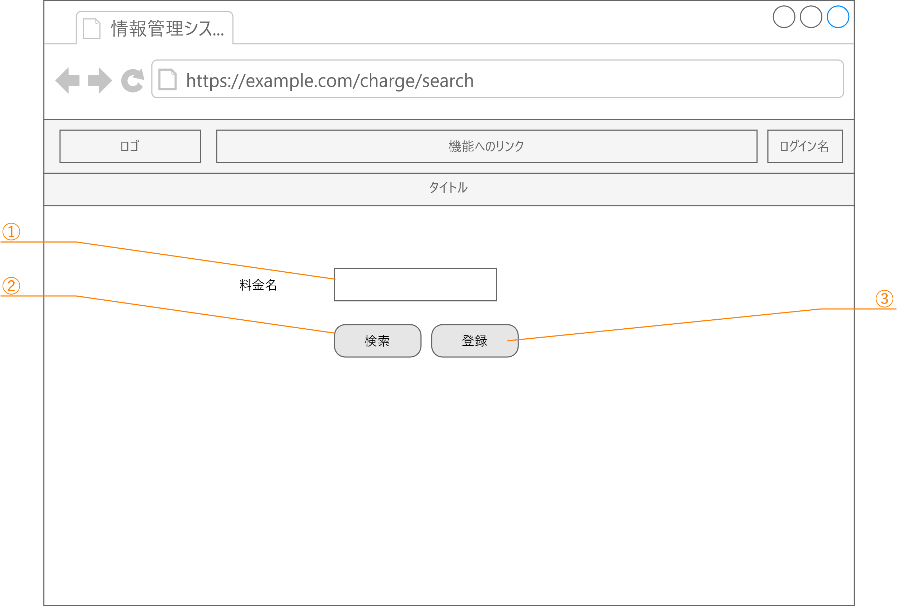

| No  | 項目ID     | 項目名   | 項目タイプ | 制限 | 備考 |
| --- | ---------- | -------- | ---------- | ---- | ---- |
| ①  | name       | 料金名   | テキスト   | ―    |      |
| ②  | search     | 検索     | ボタン     | ―    |      |
| ③  | addAccount | 新規作成 | ボタン     | ―    |      |

### イベント・アクション

#### search（クリック）

入力された「氏名」を条件に料金情報から部分検索し、その結果を「**料金検索結果一覧画面**」に表示する。

#### addAccount（クリック）

追加モードで「**料金情報編集画面**」を表示する。

## 料金検索結果一覧画面

画面ID
:   `KA020V010`

パス
:   `/charge/search`

HTTPメソッド
:   `POST`

### 料金情報検索処理

送信された料金名(name)に部分一致するレコードを、料金情報から抽出する。なお、検索条件がすべて空だった時は、料金情報からすべてのレコードを抽出する。

### 構成

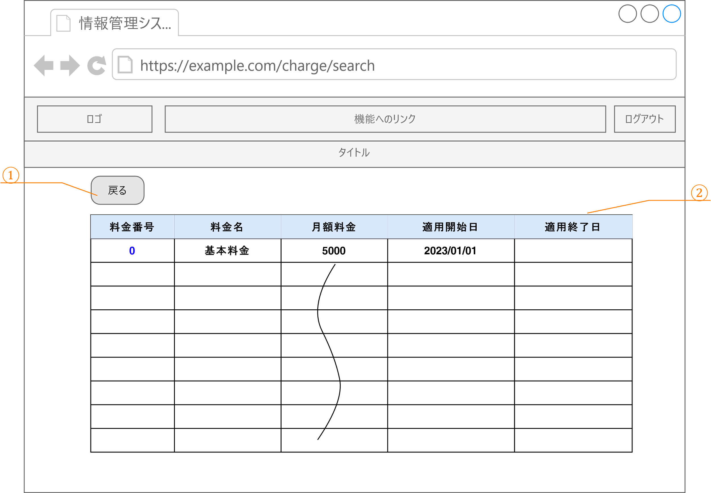

| No  | 項目ID | 項目名       | 項目タイプ | 制限/書式  | 備考           |
| --- | ------ | ------------ | ---------- | ---------- | -------------- |
| ①  | back   | 戻る         | ボタン     | ―          |                |
| ②  | result | 検索結果一覧 | テーブル   | ―          | 行数制限なし   |
|     | (項目) | 　料金番号   | リンク     | ―          | クリックすると |
|     |        | 　料金名     | テキスト   | ―          |                |
|     |        | 　月額料金   | テキスト   | ―          |                |
|     |        | 　適用開始日 | テキスト   | YYYY/MM/DD |                |
|     |        | 　適用終了日 | テキスト   | YYYY/MM/DD |                |

### イベント・アクション

#### resultの料金番号（クリック）

料金番号に対応する料金情報の**料金情報編集画面**を表示する。

## 料金情報編集画面

画面ID
:   `KA030V020`

パス
:   - 追加モード：`/charge/add`
    - 編集モード：`/charge/edit/{id}` ※{id} ... 料金ID

HTTPメソッド
:   `共通：GET`

### モード

本画面にはモードが存在する。

- 追加モード … 料金情報を新たに追加するモード。入力可能な項目はすべて空欄にして表示します。
- 編集モード … 指定された料金番号を持つ料金情報を編集するモード。料金IDに該当する料金情報を取得して、入力項目に設定して表示します。

### 構成

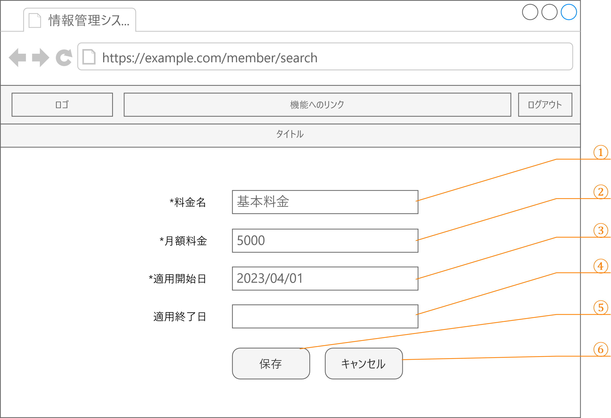

| No | 項目ID    | 項目名     | 項目タイプ | 制限/書式                  | 備考 |
| -- | --------- | ---------- | ---------- | -------------------------- | ---- |
| ① | name      | 料金名     | テキスト   | 空欄不可                   |      |
| ② | amount    | 料金       | テキスト   | 空欄不可、数字のみ、0～999999999 |      |
| ③ | startDate | 適用開始日 | 日付       | 空欄不可、YYYY/MM/DD       |      |
| ④ | endDate   | 適用終了日 | 日付       | YYYY/MM/DD                 |      |
| ⑤ | submit    | 保存       | ボタン     | ―                          |      |
| ⑥ | cancel    | キャンセル | ボタン     | ―                          |      |

### イベント・アクション

#### submit（クリック）

＜追加モード時＞

入力された情報を料金情報に追加する。正常に完了したら、登録した情報を各入力項目に設定した「**加入者編集画面**」を編集モードで表示する。

また、正常に料金情報が追加された場合は、タイトル下部に「保存しました」とメッセージを表示する。

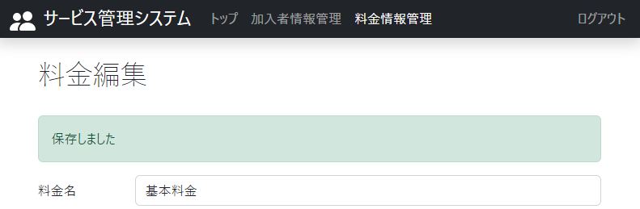

入力内容にエラーがある場合は、以下の画像の通り、エラーのある項目の入力欄のそばにエラー内容を表示する。

＜編集モード時＞

入力された情報で料金情報を更新する。正常に完了したら、登録した情報を各入力項目に設定した「**加入者編集画面**」を編集モードで表示する。

また、正常に料金情報が変更できた場合はタイトル下部に「保存しました」とメッセージを表示する。

※ 追加モード時と同様。入力内容にエラーがある場合は、エラーのある項目の入力欄のそばにエラー内容を表示する。（※ 追加モード時と同様）

#### cancel（クリック）

入力された情報を破棄し、**料金情報検索条件画面**に遷移する。