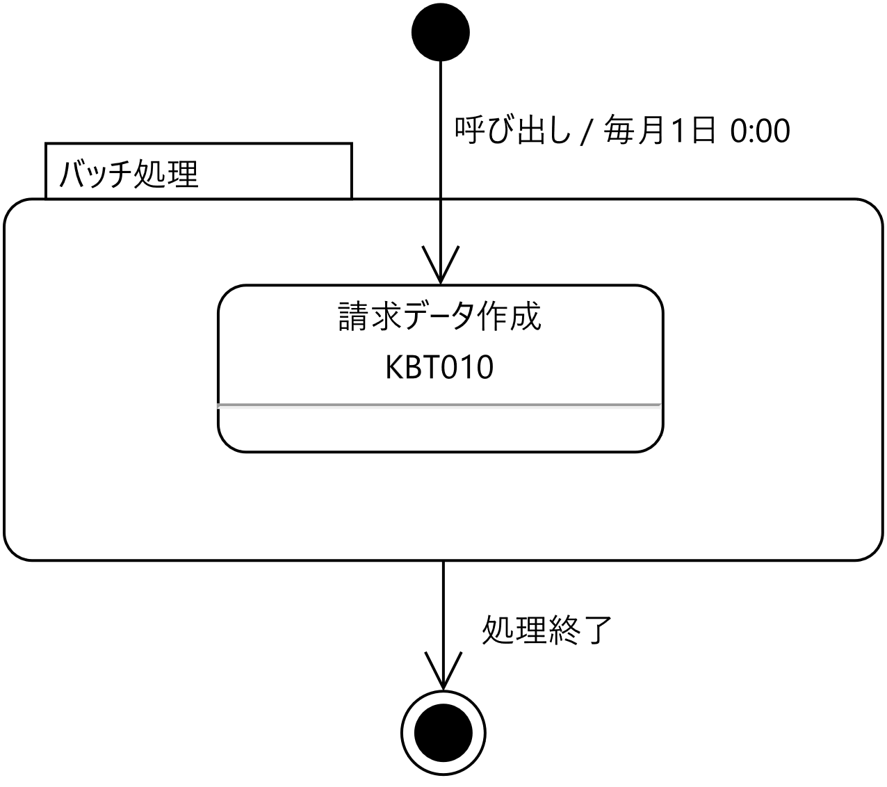
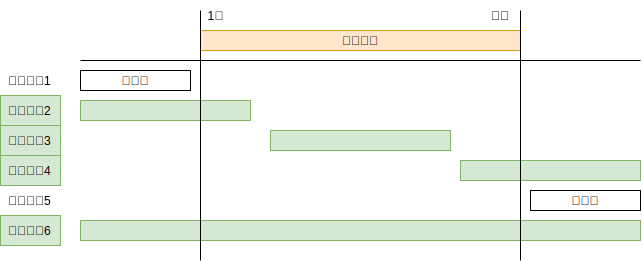

# 請求データ作成バッチ仕様書

## 概要

バッチ名
:   請求データ作成

機能ID
:   `KBT010`

実行タイミング
:   月次（毎月1日0:00）

トランザクション
:   追加する請求データおよび請求明細データ

バッチ概要
:   加入者情報と料金情報を参照し、加入者ごとに月額費用を集計、請求データとして登録する。同時に集計対象となった料金情報を請求明細データとして登録する。

リカバリ概要
:   問題箇所を修正し、再実行する。

### ジョブフロー



## 前提

- このプログラムは、スケジューラからの実行を想定し、コマンドラインアプリケーションとして作成してください。

- 請求データを格納に必要なテーブルは事前に作成します。テーブルの詳細は、テーブル定義書を参照してください。\
  (プログラム開始直後に自動生成できる場合はその機能を利用してもかまいません。)

    - 「請求データ状況」テーブル
    - 「請求データ」テーブル
    - 「請求明細データ」テーブル

## 作成処理

1.  年月の指定はコマンドライン引数として受け取る。これを対象年月とする。

2.  データベースのトランザクションを開始する。

3.  「請求データ状況」テーブルの「請求年月」列に対象年月が一致、かつ、「確定」列がTRUEであるレコードが存在するか確認する。

    - もしレコードが存在する場合、「請求データは確定済み」という旨のログメッセージを出力して、プログラムを正常終了する。
    - 存在しない場合は、つぎの処理を順次行う

        - 「請求データ状況」、「請求データ」、「請求明細データ」の対象年月に一致するレコードをすべて削除する。
        - 対象年月を「請求年月」列に、FALSEを「確定」列に設定されたレコードを「請求データ状況」テーブルに追加する。

4.  「請求データ」並びに「請求明細データ」テーブルに対して、有効な加入者情報と有効な料金情報を参照し、次のようにそれぞれのテーブルのレコード作成、追加する。

    - 請求データ(データ件数は、有効な加入者情報の数に等しい)

        - 請求年月 ← 対象年月
        - 加入者ID ← 加入者情報の加入者ID
        - メールアドレス ← 加入者情報のメールアドレス
        - 氏名 ← 加入者情報の氏名
        - 住所 ← 加入者情報の住所
        - 加入日 ← 加入者情報の加入日
        - 解約日 ← 加入者情報の解約日
        - 決済方法 ← 加入者情報の決済方法
        - 請求金額 ← 料金情報の月額金額の合計
        - 消費税率 ← 0.1(10%)固定
        - 請求総額 ← 請求金額 × (1 ＋ 消費税率) ※小数点以下切り捨て
        - レコード作成日 ← 現在の日時(CURRENT_DATETIME)
        - レコード更新日 ← 現在の日時(CURRENT_DATETIME)

    - 請求明細データ (データ件数は、有効な加入者情報と有効な料金情報の数を掛け合わせた数に等しい)

        - 請求年月 ← 対象年月
        - 加入者ID ← 加入者情報の加入者ID
        - 料金ID ← 料金情報の料金ID
        - 料金名 ← 料金情報の料金名
        - 月額金額 ← 料金情報の月額金額
        - 適用開始日 ← 料金情報の適用開始日
        - 適用終了日 ← 料金情報の適用終了日
        - レコード作成日 ← 現在の日時(CURRENT_DATETIME)
        - レコード更新日 ← 現在の日時(CURRENT_DATETIME)

5.  データベースをコミットする。

## 例外発生時の処理

「**作成処理**」を実行中に発生した例外は、基本的に継続不可能なエラーとして、次のように対応します。

1.  発生したエラー(例外)に関する情報を、ERRORログとして出力する。
2.  データベースのトランザクションを開始していた場合は、ロールバックする。
3.  アプリケーションを終了する。

## 処理仕様の詳細

### コマンドライン引数

コマンドライン引数として、対象年月を必ず一つ指定が必要です。

また、対象年月は次のような書式で指定する必要があります。

`YYYYMM`

例：請求対象年月が2023年8月の場合

`202308`

なお、コマンドライン引数が無指定、2つ以上ある場合、書式に則っていない値が引数として指定された場合は、コマンドライン引数が不正であると判断し、エラーとして処理します。

### 対象年月について

対象年月は、日付の計算や比較をしやすくするため、日付(JavaではLocalDate、SQL上ではDATE)型として取り扱います。また、「日」の値は、1 (1日)固定します。

したがって、請求年月を2025年8月とした場合は、2025/08/01が実際の値となります。

### 有効な加入者情報とは

有効な加入者情報とは、対象年月に対して、次のすべての条件に一致する加入者情報のことです。

1.  加入者情報の加入日が対象年月の末日以前
2.  加入者情報の解約日がNULLまたは、対象年月の1日以降



### 有効な料金情報とは

有効な料金情報とは、対象年月に対して、次のすべての条件に一致する料金情報のことです。

1.  料金情報の適用開始日が、対象年月の末日以前
2.  料金情報の適用終了日が、NULLまたは対象年月の1日以降


### ログとして出力する内容

ログ出力するときは、org.slf4j.Loggerオブジェクトを使用してください。

org.slf4j.Loggerオブジェクトは、import org.slf4j.LoggerFactoryオブジェクトのgetLoggerメソッドから生成することができます。

処理を行うにあたり、次の情報はINFOログとして出力します。

- 処理開始を示す “-“(半角ハイフン) 40個
- 対象年月
- 各テーブルへの操作(追加、変更、削除)の概要と件数（※）
- 処理終了を示す “-“(半角ハイフン) 40個

例外 (プログラム実行継続不可能なエラー) が発生したときは、ERRORログとして、(※)部分に出力します。

例外時に出力するERRORログのメッセージとして、

- どのような処理に失敗したか。
- 発生した例外が持つメッセージ

以下は、ログ出力例です。紙面横幅が足りていないため、Loggerを使用すると出力される日付等の部分は除いた、メッセージ部分のみ掲示しています。

```
2023年09月分の請求情報を確認しています。
データベースから2023年09月分の未確定請求情報を削除しました。
2023年09月分の請求ステータス情報を追加しています。
1件追加しました。
2023年09月分の請求データ情報を追加しています。
3件追加しました。
2023年09月分の請求明細データ情報を追加しています。
9件追加しました。
```